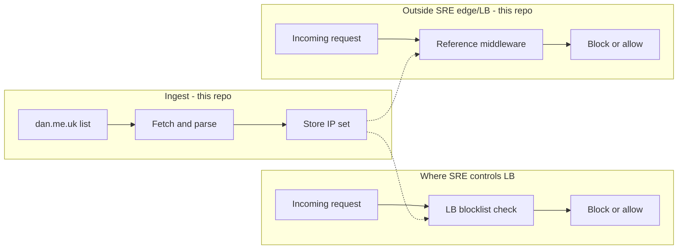

# Architecture: TOR Exit Node Blocking

## Goal

Block app access from known TOR exit nodes for production. Primary need: Meridial (Marketplace). **Phased rollout:** (1) Cloudflare first – covers Marketplace UI and CF-proxied services, not Marketplace API; (2) this repo for Marketplace API and non-Cloudflare coverage. No allowlisting.

## Phased rollout

- **Phase 1 (Cloudflare):** Block TOR at Cloudflare security rules (same mechanism as SRE-853 tier-1 geo-block). Covers Marketplace UI and any production resource that uses Cloudflare as proxy/CDN. Does **not** cover Marketplace API or services not behind Cloudflare.
- **Phase 2 (this repo):** Block TOR from Marketplace API and other non-Cloudflare endpoints using the fetcher (list source) plus load balancer blocklist or reference middleware. Same approach as SRE-999 for cloud providers.

Phase 1 is implemented in Cloudflare (outside this repo). This repo implements Phase 2.

## High-level flow (Phase 2)

## Components

### 1. Ingest (this repo)

- **Fetcher** (`tor-exit-fetch` / `python -m tor_exit_block.fetcher`): Fetches `https://www.dan.me.uk/torlist/?exit`, parses one IP per line (IPv4 and IPv6), writes:
  - **LB blocklist file:** `data/tor-exit-nodes.txt` (one IP per line) for load balancers that SRE controls.
  - **Middleware input:** Same file is read by the reference middleware (file or in-memory).
- **Scheduling:** Run fetcher periodically (e.g. hourly via cron). On failure, the previous file is left in place; Datadog events/metrics signal failures.

### 2. Load balancer blocklist (where SRE controls LB)

- Configure the LB (e.g. nginx, HAProxy, ALB) to deny requests whose client IP is in the blocklist file.
- Client IP in set → 403 (or agreed response); otherwise allow.
- Use consistent client-IP logic (trusted proxies) if the LB supports it.
- Document which LBs are in scope and how to add new ones.

### 3. Reference middleware (this repo)

- For systems **not** behind SRE-controlled edge or LB, apps use the WSGI middleware from this repo (e.g. `TorExitBlockMiddleware`).
- Middleware: loads the exit list from the same file, resolves client IP (X-Forwarded-For / X-Real-IP with configurable trusted proxy count), checks membership, returns 403 with generic body on match and emits a block event to Datadog; otherwise calls the next app.
- No allowlisting.

## Observability (Datadog)

- **Fetcher:** Metrics (list size, fetch success/failure, list age); events on fetch failure. Alerts on fetch failures and list too stale.
- **Middleware:** Block events (client IP, path, timestamp); optional block-count metric and alert on high block rate.

## Scope

- **Meridial (Marketplace)** is the primary need. Cloudflare (Phase 1) covers Marketplace UI; this repo (Phase 2) covers Marketplace API and other non-Cloudflare endpoints. Goal: all prod resources where feasible (same approach as geo-based blocking: SRE-853 at Cloudflare, SRE-999 for cloud providers).
- **Phase 1:** Enforcement at Cloudflare (security rules). **Phase 2:** Enforcement at LB (blocklist file) or application layer (reference middleware) for API and non-CF services.
